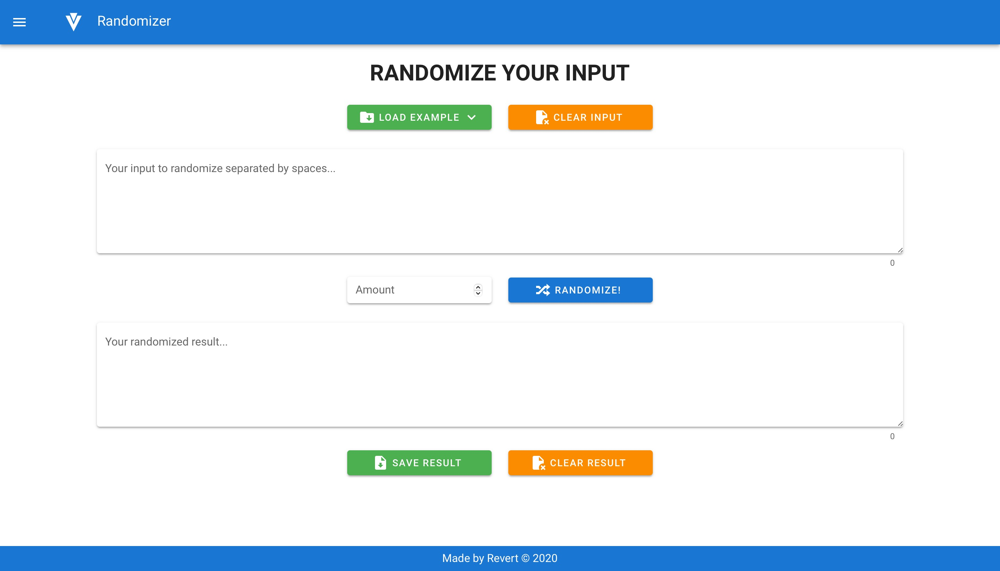
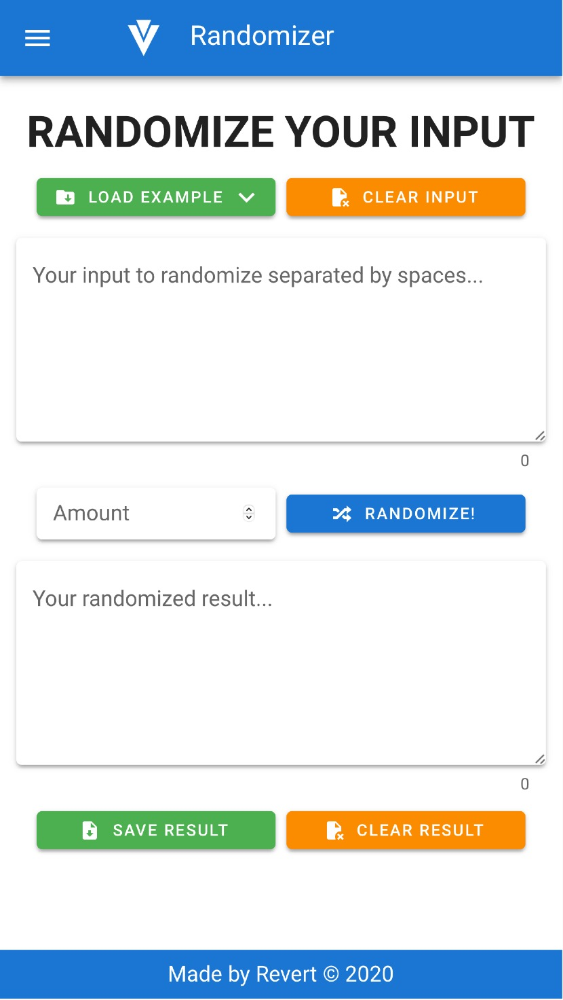

# V Randomizer

> Simple RNG and words randomizer written in Vue.js v2 with Vuetify UI.

## Demo
[riwert.github.io/vue-randomizer](https://riwert.github.io/vue-randomizer)

## Screenshot on desktop


## Screenshot on mobile


## Project setup
```
npm install
```

### Compiles and hot-reloads for development
```
npm run serve or npm start
```

### Compiles and minifies for production
```
npm run build
```

### Lints and fixes files
```
npm run lint
```

### Customize configuration
See [Configuration Reference](https://cli.vuejs.org/config/).
